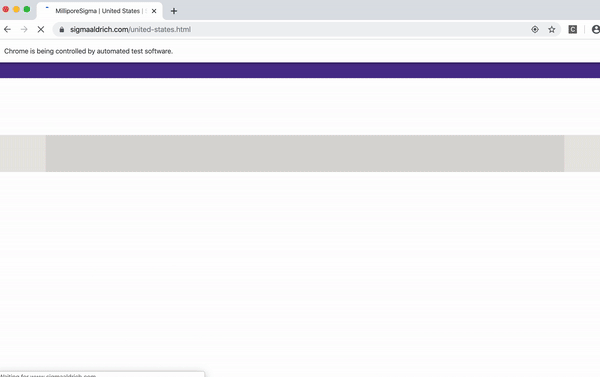

# scraping_by_selenium

## Because these websites are generated by javascript, a normal webscraping with Beautifulsoup doesn't get the contents.
## Instead, Selenium can scrape. We can scrape any any sites dinamically.
## My lab needed to get CAS numbers of chemicals by hand, so I automated the process by selenium.

